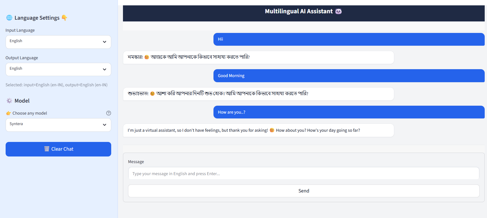

Perfect 👍 I’ll update your compact **README.md** with:

* ✅ A working **Live Demo** link (clickable)
* ✅ A **screenshot preview section** so people can see your app UI

Here’s the improved version 👇

```markdown
# 🌍 Multilingual Chatbot (Sarvam AI + Streamlit)

A multilingual chatbot built with **Sarvam AI API** and **Streamlit**, supporting multiple Indian languages.  

👉 [**Live Demo**](https://multilanguage-hk-bot.onrender.com)

---

## 📂 Project Structure
```

Multilingual\_chat/
│── .env
│── requirements.txt
│── app.py
│── README.md

````

---

## ⚙️ Setup

1. **Clone repo & install dependencies**
   ```bash
   git clone <your_repo_url>
   cd Multilingual_chat
   pip install -r requirements.txt
````

2. **Add API key** → create `.env` file:

   ```ini
   SARVAM_API_KEY=your_api_key_here
   ```

3. **Run app**

   ```bash
   streamlit run app.py
   ```

   Open 👉 `http://localhost:8501`

---

## 🌐 Supported Languages

* English (en-IN)
* Bengali (bn-IN)
* Gujarati (gu-IN)
* Hindi (hi-IN)
* Kannada (kn-IN)
* Malayalam (ml-IN)
* Marathi (mr-IN)
* Odia (od-IN)
* Punjabi (pa-IN)
* Tamil (ta-IN)
* Telugu (te-IN)

---

## 🖼️ Preview

[](https://multilanguage-ai-chatbot.onrender.com)


---

🚀 Start chatting in your language!

